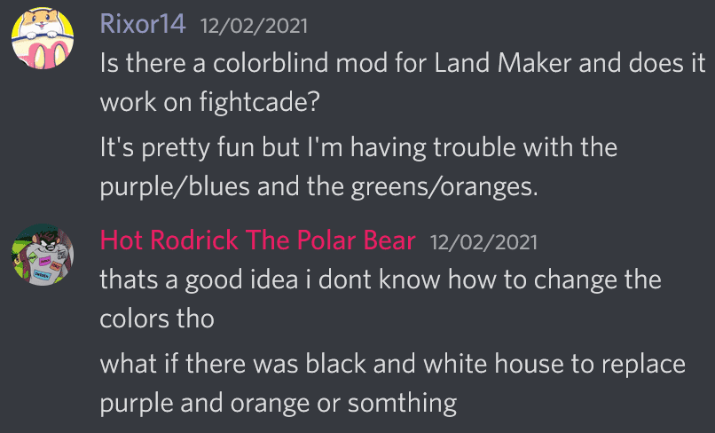

# land maker palette mods
y's palette mods

use [PalMod with Land Maker Support](https://github.com/y-ack/PalMod/releases/tag/v.177l%2BLM) to edit
palettes

## colorblind
land maker is a bit troublesome for colorblind folks due to being a) a
color-based tile puzzle game and b) having no texture detail differences for
each color (unlike taito's similar puzzle bobble).

also unlike other puzzle games (puzzle bobble, super puzzle fighter ii
turbo, etc.) , this can't really be fixed by just
swapping tile colors and calling it a day: every single character* has unique
palette entries for their respective structures, the buildings formed
when joining tiles.
this means 'changing a color' involves changing 10 character palettes (8 if you
don't care about bosses), the basic tile palette, and then there's also a
corner shine and adjacent color conversion effect palettes.

(*except soumei, who shares most palettes with hiryu)

but at least if you have a good alternative palette already it can just be
copied around within characters as needed to deal with problematic colors.

someone in the **puzzle wednesday** discord suggested a good general
alternative of a black and white house palette. since this is more likely to be
able to help generally, can be rearranged as needed for any color vision
anomaly and without additional feedback, y decided to try implementing them.

### black/white palettes
("lazy" black/white palette sets)[lazy-bw/README.md]

### other...
maybe other colorblind palettes in the future on individual request?

## characters
