# black/white palettes
some of these palettes started out derived from rinrei (white) and roushinshi (black)
MAP BUILDING palettes, interpolating to the number of colors needed.

later white palettes started with ORANGE, changed all orange saturations to
around 16-20, then increased lightness. the lightest color usually ends in the
92-96 range, and the darkest shadow color around 41. but judged by visual.

later black palettes started with PURPLE, changed saturations to around 8-12,
then decreased lightness. usually starting by subtracting around 20% lightness
from relevant colors and then adjusting manually. darkest 8-14%, lightest
around 52?

referencing other color palettes to check relative contrast of colors on texture.

ips patches are currently available for:
 - [landmakr (2.02O): replace purple, orange with black, white](bw-landmakr-po/)

# PalMod Strings.
if the provided color patches don't cover your case(likely!)
and you want to try patching the game yourself, 

you can copy and paste them into PalMod to replace problematic colors.

(and then, perhaps, tell y what worked so that patch set can be provided too!)

## Common/Tile
### White
`(w1FF000000FF707078FF787880FF808890FF9098A0FF98A0A8FFA8B0B8FFB0C0C8FFC0D0D8FFC8D0D8FFD0D8E0FFD8E0E0FFE0E0E8FFE8E8E8FFF0F0F0FFF8F8F8)`

## Common/Tile
### Black
`(w1FFD8A868FF141414FF161616FF1E1E1EFF282828FF303030FF383838FF474747FF595959FF606060FF686868FF7A7A7AFF878787FFA0A0A0FFB2B2B2FFE0C8C8)`

## Common/Corner Shine
### White
`(wAFF000000FF000000FF000000FF000000FF000000FF000000FF000000FF000000FF000000FF7A7A7AFF7C7C7CFF828282FF878787FF898989FF8E8E8EFF939393FF969696FF9E9E9EFFA3A3A3FFA4A8ABFFAAADB0FFAFB2B5FFB2B5B7FFBCBFC2FFC1C5C7FFCACCCDFFD2D4D5FFD9DBDCFFDFE0E1FFEAEAEAFF000000FF000000)`

## Common/Corner Shine
### Black
`(wAFF000000FF000000FF000000FF000000FF000000FF000000FF000000FF000000FF000000FF2D2D2DFF303030FF3A3638FF3F3A3EFF474245FF494448FF514C50FF554E53FF5C565AFF645D62FF6D646AFF71696FFF746C71FF7A7579FF7F7A7EFF847F83FF847F83FF938E92FF989497FFA5A1A3FFB2B2B2FF000000FF000000)`

## Common/Color Spread
this effect is not critical for reading.

### White
`(wAFF000000FF000000FF000000FF000000FF000000FF7A7A7AFF7C7C7CFF828282FF878787FF898989FF898989FF8A8A8EFF8E8B8AFF8C8C91FF969696FF979C9FFF9A9EA1FF9FA3A6FFA5A8ABFFA9ADB0FFAFB3B5FFB8BABCFFBABDBEFFBFC2C3FFC5C7C8FFCCCCCCFFD2D3D4FFDBDBDBFFDFE0E1FFE8E8E8FF000000FF000000)`

### Black
`(wAFF000000FF000000FF000000FF000000FF000000FF2D2D2DFF303030FF3A3638FF3F3A3EFF474245FF494448FF514C50FF554E53FF5C565AFF645D62FF6D646AFF71696FFF746C71FF7A7579FF7F7A7EFF847F83FF847F83FF938E92FF989497FFA5A1A3FFB2B2B2FFB9B5B8FFC3C0C3FFCAC7C9FFD6D6D6FF000000FF000000)`

## Hiryu/Soumei
⚠ these palettes could use more attention ⚠
### White
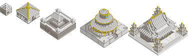
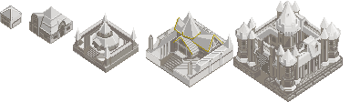
`(wAFF000000FFF7F7F7FFEEEFF0FFE6E8E9FFD7D9DAFFCED1D3FFA3A5A7FFBEC1C5FF889094FF6C7179FF78838BFF61696FFF0090A8FF787880FFF800F8FFE8B840FF48F800FF28B8D0FF383838FF304830FF285828FF206820FFF8F8F8FF2828E0FF4848E0FF6868E8FF8890E8FFA8B0F0FFD0D8F8FF000000FFC8E8C8FFF8F8F8)`

### Black
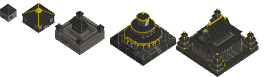
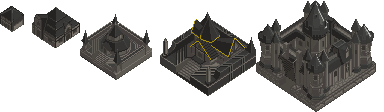
`(wAFF000000FFB2B2B2FF525555FF3E4040FF373838FF343536FF222324FF697177FF545A5DFF3E4146FF42484CFF2F3336FF0090A8FF787880FFF800F8FFE8B840FF48F800FF28B8D0FF383838FF304830FF285828FF206820FFF8F8F8FF2828E0FF4848E0FF6868E8FF8890E8FFA8B0F0FFD0D8F8FF000000FFC8E8C8FFF8F8F8)`

## Aifa
### White
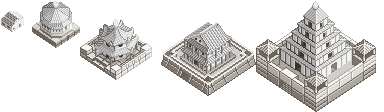
`(wAFF000000FF69696CFFACACAEFF929495FFC0C0C3FFD7D9D9FFF4F4F5FFE2E3E3FFEDEDEDFF333537FF4B4E52FF7A7F84FFADAFB2FFCFD0D2FFF1F2F2FFEFEFF0FFE0E8F8FF565E65FF5E666EFF6F7680FF9FA7ACFFCACFD2FFDBDEE0FFF6F7F7FFF800F8FFF800F8FFF800F8FFF800F8FFF800F8FFF800F8FFF800F8FF981880)`

### Black
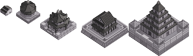
`(wAFF000000FF2D2D2EFF444445FF1E1E1EFF48494BFF555858FF6E6E76FF9C9F9FFFAAAAAAFF322E31FF353034FF5D555BFF696267FF7C7379FF979097FFC6C2C6FFF8F8F8FF565155FF666065FF787177FF736C72FF979094FFA8A2A7FFC3BFC3FFF800F8FFF800F8FFF800F8FFF800F8FFF800F8FFF800F8FFF800F8FF981880)`

## Renki
### White
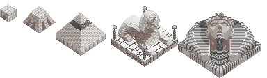
`(w1FF000000FFF0F0F0FFF1F2F3FFE7E8E8FFD9DCDDFFC0C4C8FF9BA0A5FF959AA1FF767983FF60687AFFC0C0C0FF808080FF606060FF505050FF666666FF494949)`

### Black
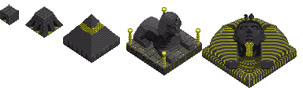
`(w1FF000000FFBABABAFF625F62FF575557FF4D4B4CFF3B393BFF343133FF343134FF242324FF151315FF45E7E7FF218686FF167272FF1B9B9BFF065555FF003D3D)`

## Youen
### White
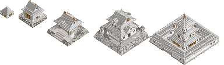
`(wAFF000000FF808084FF8E9193FF848789FF939598FFC2C4C5FFDEE0E1FFCDCFCFFFDBDBDBFFF6F7F7FF4F4F4FFF676A6EFF808388FFA0A2A6FFC7CAD0FFECECEDFFF6F6F8FF596363FF6E8080FF8C9B9BFF55595DFF6F757AFFB1B6B8FFACBBC2FFBEC9CFFFD8DFE3FF103848FF285070FF406890FF5880B0FF78A0D0FFA0C0F0)`

### Black
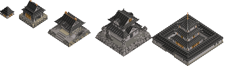
`(wAFF000000FF161616FF252727FF2D2E2EFF2F2F31FF3F3F40FF4B4F52FF5A5C5CFF7F7F7FFF8B9696FF3D3D3DFF333537FF4C4E51FF6A6C71FF84878EFF9E9EA3FF858592FF596363FF6E8080FF8C9B9BFF3A3D3FFF55595DFF686F72FF6E8895FF8097A2FF9AACB5FF103848FF285070FF406890FF5880B0FF78A0D0FFA0C0F0)`

## Kouko
⚠ these need more attention (bronze structure) ⚠
### White
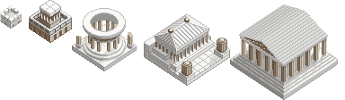
`(wAFF000000FF78787CFF7F8284FF919496FFA6A7AAFFBBBDBEFFD9DCDCFFF4F5F5FFF9F9F9FFCFD9DCFF2D333DFF444E5EFF727272FF6888B8FF90A8D0FFB8C8E8FFE0E8F8FF394D5FFF4A5B6DFF566A7FFF80939CFFABB8BEFFB9C8CFFFD5E0E6FFF800F8FFF800F8FFF800F8FFF800F8FFF800F8FFF800F8FFF800F8FFF800F8)`

### Black
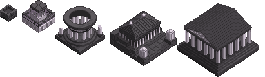
`(wAFF000000FF141314FF222022FF272526FF2F2C2FFF393639FF474246FF534F52FF5D595DFF686466FF52464FFF6B5B67FF7E6C7AFF9C8B98FFC0A8C0FFE0D0E0FFF8F8F8FF5A5259FF655C63FF786D76FF8F848DFFA89DA6FFCBBCC8FFE6DAE6FFF800F8FFF800F8FFF800F8FFF800F8FFF800F8FFF800F8FFF800F8FFF800F8)`

## Rinrei
### White
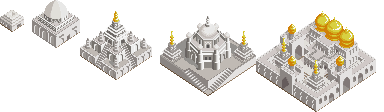
`(wAFF000000FF525255FF8E9193FFB4BAC0FFC7C9D0FFDADFE1FFE9EAEBFFE7E8E8FFEFEFEFFFF6F7F7FF5C5C65FF777982FF82858BFF91959AFF9C9FA4FFE1E2E4FF385068FF486078FF688098FF626469FF6E7377FF878C90FFCCCED0FFECEDEDFFF7F7F7FF0880D0FF20B0D0FF40D0D8FF000000FF000000FF000000FF000000)`

### Black

`(wAFF000000FF141414FF2C2D2EFF252626FF343436FF434546FF505153FF6E7171FF7A7A7AFFECEEEEFF3D3D3DFF333537FF4C4E51FF6A6C71FF84878EFF9E9EA3FF695D66FF8E808BFF9C909AFF3C393BFF4B484AFF625F62FF7C787CFF9B9699FFB6B3B6FF0880D0FF20B0D0FF40D0D8FF000000FF000000FF000000FF000000)`

## Roushinshi
### White
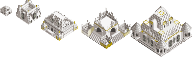
`(wAFF000000FF636972FF858B93FFAEAFB1FFC0C4C8FFF6F6F7FFE9EBEBFFF6F7F7FF3E4145FF858A93FF858993FF92979FFFADB1B7FFC6C8CCFFF1F2F3FF485050FF606868FF788080FF90A0A0FF005870FF007890FF0090A8FF28B8D0FFF800F8FFF800F8FFF800F8FFF800F8FFF800F8FFF800F8FFF800F8FF3030B0FFE8B840)`

### Black

`(wAFF000000FF292328FF312A30FF3C383CFF464346FF5B565AFF857E84FF8A8389FF3F363CFF544F52FF565155FF5E585EFF5E585EFF726D72FF847F84FF485050FF606868FF788080FF90A0A0FF005870FF007890FF0090A8FF28B8D0FFF800F8FFF800F8FFF800F8FFF800F8FFF800F8FFF800F8FFF800F8FF3030B0FFE8B840)`

## Ranju
not yet :( not used competitively

## Gaira
not yet :(
